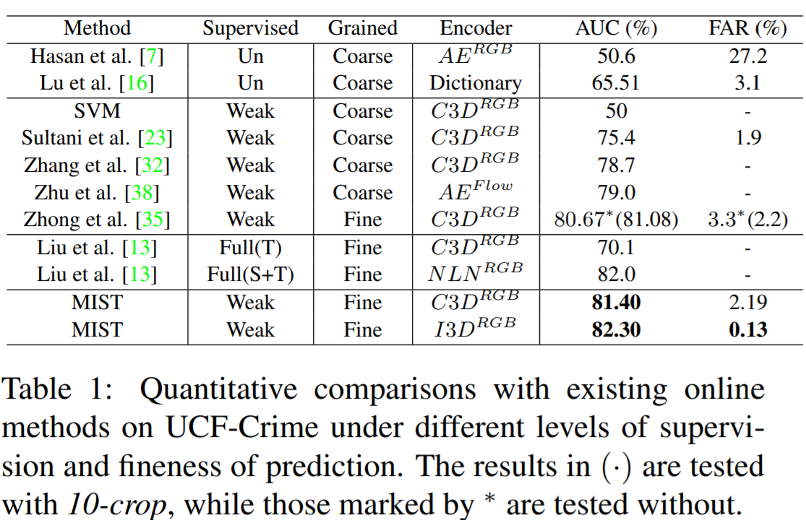
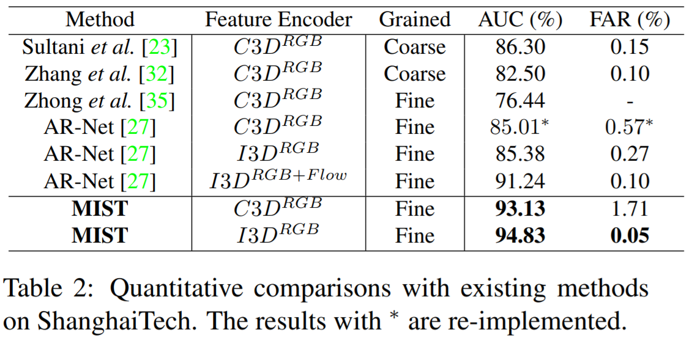
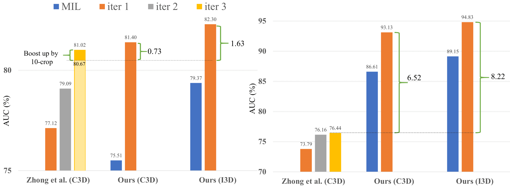
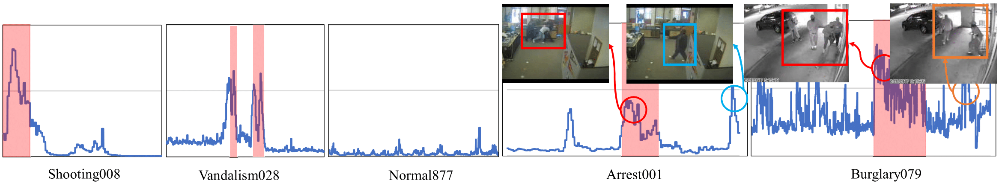
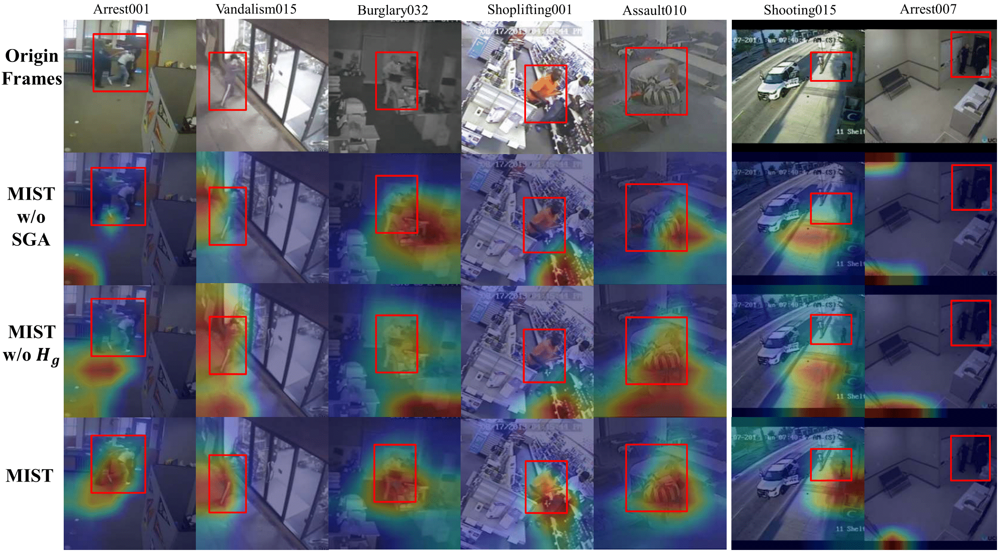

# MIST: Multiple Instance Self-Training Framework for Video Anomaly Detection

Published in ***IEEE International Conference on Computer Vision and Pattern Recognition* (CVPR), 2021**

Recommended citation form: 

> Jia-Chang Feng, Fa-Ting Hong and Wei-Shi Zheng. “MIST: Multiple Instance Self-Training Framework for Video Anomaly Detection, Proceedings of the IEEE International Conference on Computer Vision and Pattern Recognition. 2021.

## Brief Biography

Weakly supervised video anomaly detection (WS-VAD) is to distinguish anomalies from normal events based on discriminative representations. Most existing works are limited in insufficient video representations. In this work, we develop a multiple instance self-training framework (MIST)to efficiently refine task-specific discriminative representations with only video-level annotations. In particular, MIST is composed of 1) a multiple instance pseudo label generator, which adapts a sparse continuous sampling strategy to produce more reliable clip-level pseudo labels, and 2) a self-guided attention boosted feature encoder that aims to automatically focus on anomalous regions in frames while extracting task-specific representations. Moreover, we adopt a self-training scheme to optimize both components and finally obtain a task-specific feature encoder. Extensive experiments on two public datasets demonstrate the efficacy of our method, and our method performs comparably to or even better than existing supervised and weakly supervised methods, specifically obtaining a frame-level AUC 94.83% on ShanghaiTech.


## Experimental Results







## Visualization






<!-- blank line -->
<figure class="video_container">
  <video controls="true" allowfullscreen="true">
    <source src="fjchange.github.io/vid/MIST_CVPR21_demo.mp4" type="video/mp4">
  </video>
</figure>
<!-- blank line -->


***```Paper```*** [Download paper here](https://arxiv.org/abs/2104.01633)

